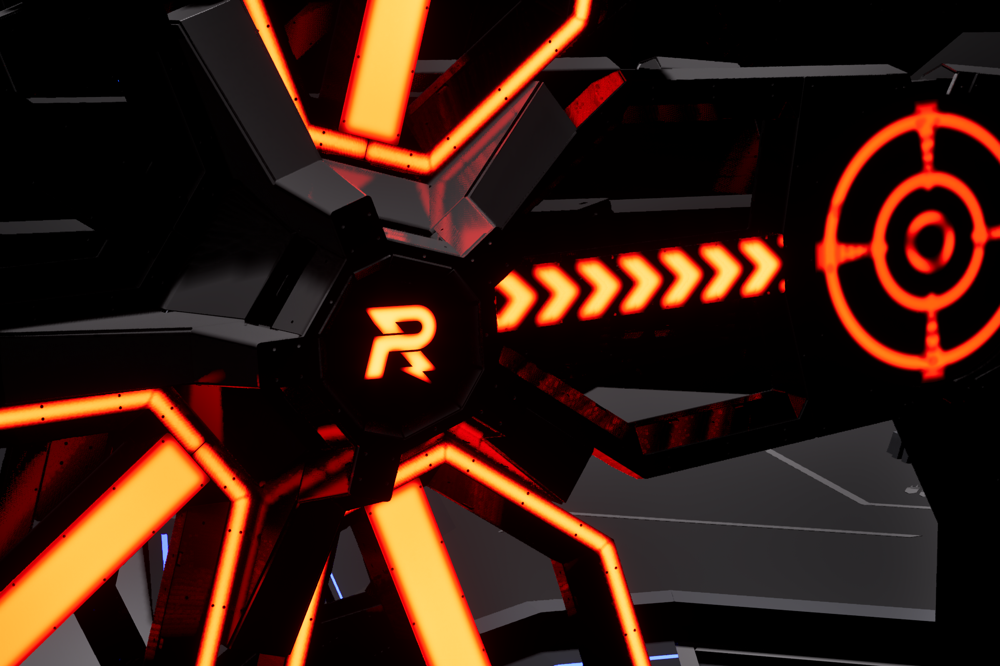
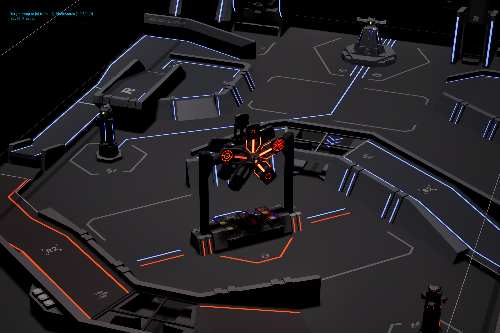
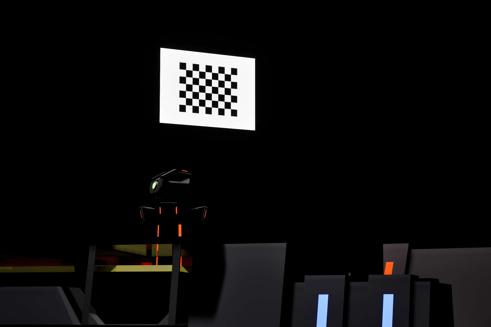

# PowerRuneSimulator
## 基于Unreal Engine 5的能量机关模拟器

主要用途：

- 为无法搭建实体能量机关的RoboMaster参赛队伍提供训练替代方案
- 利用UE5光线追踪引擎构建高质量视觉效果
- 支持通过投影呈现，结合相机或按键的击打反馈方式
- 提供近似实战的训练环境，便于视觉识别与预测功能的开发调试

模型文件来自：[【RM2024赛季-官方开源】场地图纸&定位点](https://bbs.robomaster.com/article/9601)

**按键操控示例：**

| 按键        | 功能                         |
|-------------|------------------------------|
| P           | 切换能量机关可激活状态 |
| M           | 切换相机动态模糊效果的开启状态 |
| B           | 切换大 / 小能量机关            |
| Backspace   | 重置所有扇叶激活状态           |
| 1 ~ 9、0    | 触发第 1 ~ 10 环命中           |
| 鼠标左键    | 运行时锁定 / 解锁视角跟随      |
| W / A / S / D | 控制相机移动                 |
| Ctrl        | 控制相机下降                   |
| Space       | 控制相机上升                   |

**TODO:** 相机画面小弹丸落点映射

**运行效果展示:**

场景中额外提供了一块8x6的标定板以供录制视频使用:

